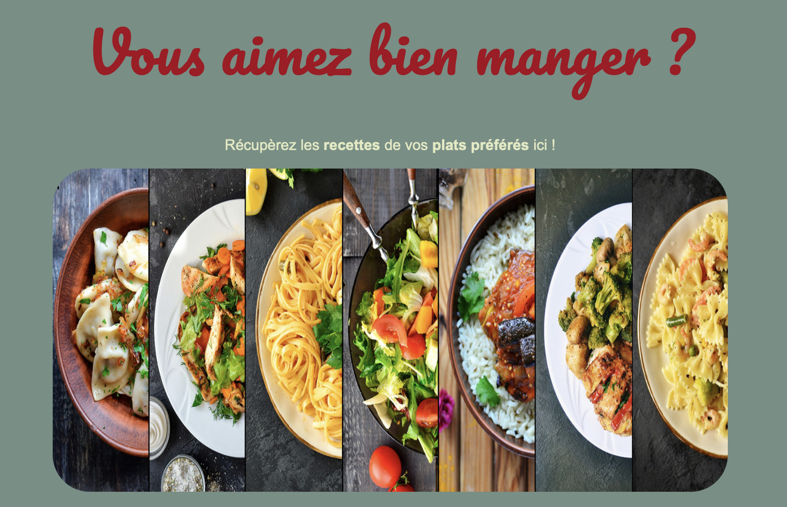
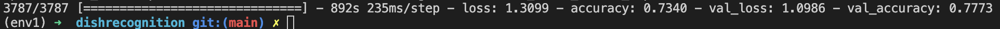

# bienmanger



## Description

This project aims to recognise dishes with a neural network to indicate its ingredients and nutritional values. It uses TensorFlow and Keras, and is trained on the [Food 101 dataset](https://www.kaggle.com/datasets/kmader/food41).
We wanted to create a website on which the user can load an image and get back the name of the dish with a link to several recipes. We also added options to return the score or nutriscore of the dish as well as wine recommendations.

Note : this project was done in November 2022 and used to be on a Gitlab server from CentraleSupélec which has been deleted. Unfortunately old commits have been lost and it is just a reupload.

## Installation

The whole project was tested on Python 3.10.6. See `requirements.txt`. The libraries used are :

* opencv-python
* tensorflow (tensorflow-macos & tensorflow-metal on M1/M2 Macs)
* tensorflow-gpu
* numpy
* deep_translator
* flask

On Mac run :

```
git clone git@gitlab-cw5.centralesupelec.fr:ulysse.corne/bienmanger_mmmg.git
cd bienmanger_mmmg
python3 -m venv env1
source env1/bin/activate
pip install -r requirements-mac.txt
python3 main.py
```

On Windows (git-bash) run :

```
git clone git@gitlab-cw5.centralesupelec.fr:ulysse.corne/bienmanger_mmmg.git
cd bienmanger_mmmg
python -m venv env1
source env1/Scripts/activate
pip install -r requirements.txt
python main.py
```

By default the local server listens on [127\.0.0.1:8080](http://127.0.0.1:8080)

## Neural network training

Our neural network was trained using Keras on the Food 101 dataset. It does data augmentation using ImageDataGenerator from Keras. The script `model_training.py` is used to train a given model or create a new one and save it to a new file. Please note that the `init` part of this script is written to use a M1 Mac GPU.

An already trained model based on MobileNetV2 and trained with 15 epochs on Food 101 is provided as `model_trained.h5`. It is loaded by default by `main.py`.



## Limitations

Due to the nature of the training of this neural network, it can only recognise the 101 dishes present in the Food 101 dataset. A lot of american food is present and some french food is missing.

Accuracy and loss could be better.

In order to add different options, we used the API Spoonacular which can only be used 150 times a day [Spoonacular API](https://spoonacular.com/food-api)

## Team

* Maximilien CHAMPY
* Bastien BORDIGONI
* Raphaël NUNES DA SILVA
* Ulysse CORNE
